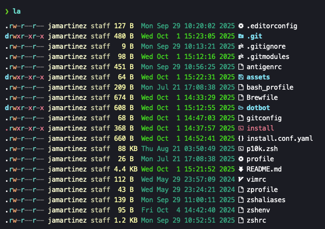
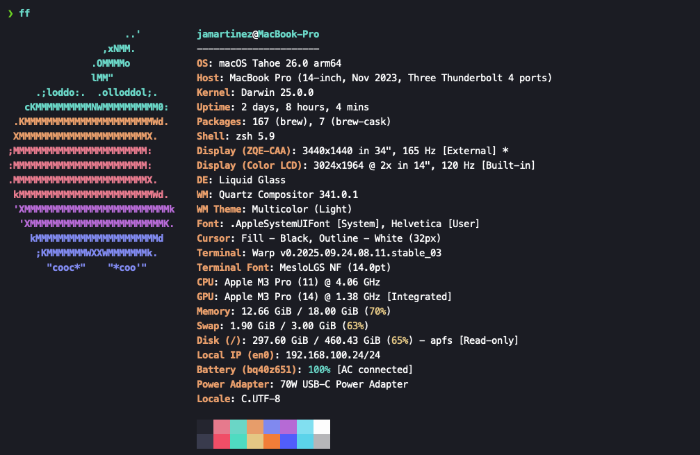

# Dotfiles

My personal configurations (dotfiles) for a productive and pleasant development environment on macOS. This repository automates the installation and management of tools such as **Zsh**, **Vim**, **Git**, and more, using [Homebrew](https://brew.sh/) and [Dotbot](https://github.com/anishathalye/dotbot).

## 🚀 Features

- **Automated**: Easy one-command installation (`./install`).
- **Customizable**: Fork and adapt to your own needs.
- **Portable**: Consistent setup across different Mac machines.
- **Managed**: Dotbot handles symlinks and installation steps declaratively.

## 🛠 Prerequisites

- **macOS**: (Catalina or later recommended)
- **Xcode Command Line Tools**: installed (run `xcode-select --install` if not already installed)
- **Homebrew**: installed (see [https://brew.sh/](https://brew.sh/))
- **Git**: configured globally

## ⚙️ Installation

> ⚠️ WARNING: These are my personal configuration files. Running the install script will overwrite your existing configurations (`.zshrc`, `.gitconfig`, etc.).

1. Fork this repository first. This allows you to customize it to your liking and safely save your own changes in your GitHub account.

2. Clone your forked repository to your local machine. Recommended location is `~/dotfiles`:

   ```bash
   # Replace `your-username` with your GitHub username
   git clone --recursive git@github.com:your-username/dotfiles.git ~/dotfiles
   ```

   _The `--recursive` flag ensures that any submodules are also cloned._

3. (Optional) Modify files like `gitconfig`, `zshrc`, and `Brewfile` to suit your preferences.

4. Navigate to the cloned repository and run the install script:

   ```bash
   cd ~/dotfiles
   ./install
   ```

   The script `./install` will automatically:

   - Create symlinks for configuration files in your home directory.
   - Install packages and applications listed in the `Brewfile`.

5. Restart your terminal to apply changes.

## 📸 Screenshots





## 💡 Customization

- Edit the `Brewfile` to install only the packages you use.
- Modify `install.conf.yaml` to add or remove symlinks.
- If there is any configuration file you don't want, delete or comment it out in `install.conf.yaml`.

## 🧾 License

MIT License

See [LICENSE](LICENSE.md) for more information.
